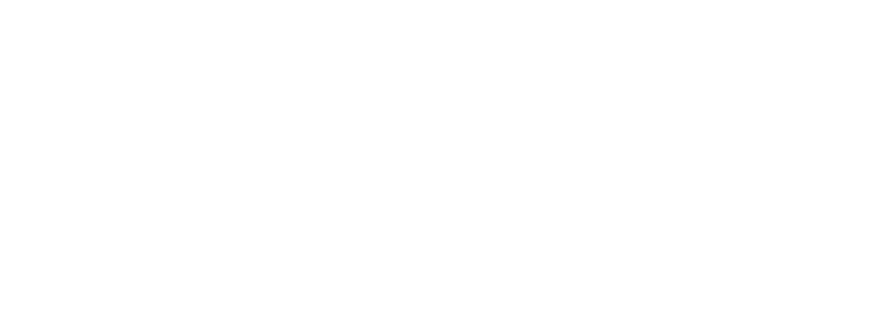

Hi my name is Eoin Mc Allister and welcome to my GitHub. 

(Lots of content set to Private)

I am a ML / Software Engineer with a MSc in Computer Science (AI). I graduated with a First Class Honours from NUIG Ireland in 2021. My main area of interest was Deep Reinforcement Learning in which I wrote a highly graded thesis on.

I now focus Deep Learning and some Finance projects

Ive created Mac Projects as a place to show off my skills and research. This version of my GitHub started in Autumn of 2022 so lots of content is on the way!

Feel free to contact me at either my email or LinkedIn:
- eoinmc.james@gmail.com
- [LinkedIn](https://www.linkedin.com/in/eoin-mcallister-ml/)

N.B. Projects without some sort of presentable data are not commited to public
