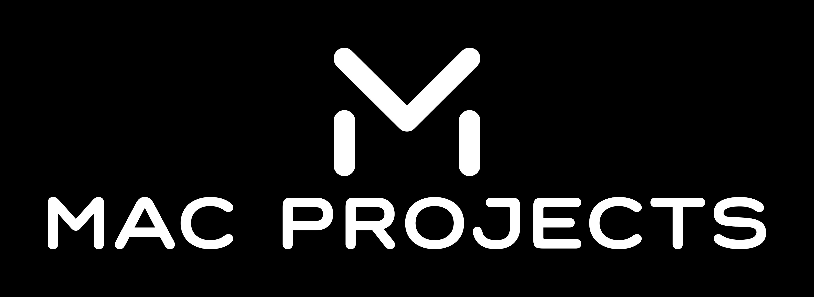

Hi my name is Eoin Mc Allister and welcome to my GitHub. 

I am a ML / Software Engineer with a MSc in Computer Science (AI). I graduated with a First Class Honours from NUIG Ireland in 2021. My main area of interest was Deep Reinforcement Learning in which I wrote a highly graded thesis on.

Ive created Mac Projects as a place to show off my skills and research in a tutorial like style. This project started in Autumn of 2022 so lots of content is on the way!

I will have 4 main repos:
- RL World - Everything Reinforcement Learning
- NLP World - Everything NLP
- CV World - Everything Computer Vision
- More Projects - Everything else such as DSA work and projects for my website

My website is https://www.mcproai.com
My Medium URL is https://medium.com/@Mac_Projects

Feel free to contact me at either my email or LinkedIn:
- eoinmc.james@gmail.com
- https://www.linkedin.com/in/eoin-mcallister-ml/
